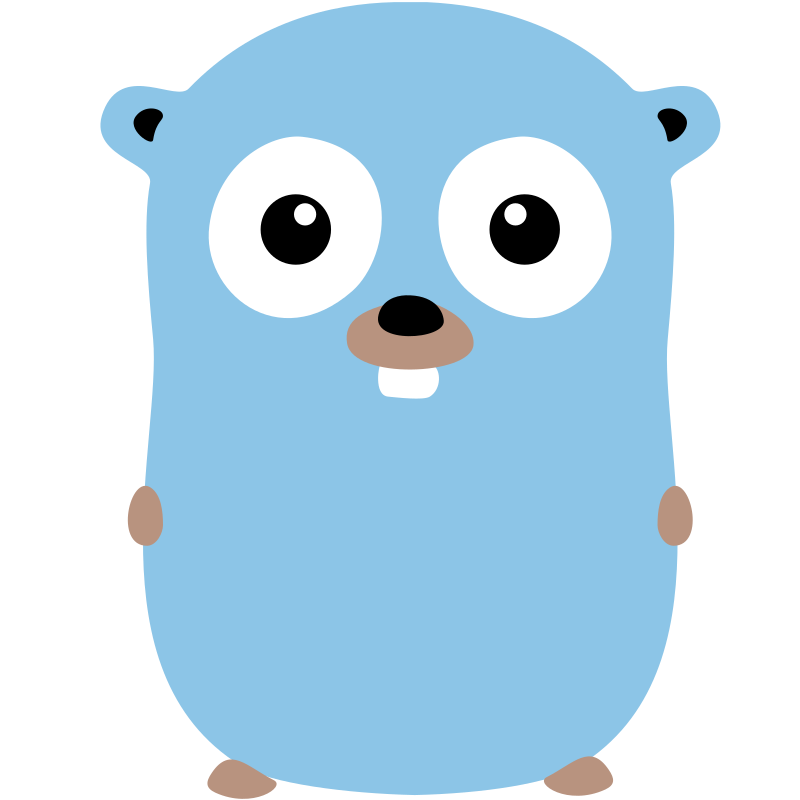

## Go Project Template

<div align="center">
  <picture>
    
  </picture>
</div>
<br>

[](https://github.com/habedi/template-go-project/actions/workflows/tests.yml)
[](https://github.com/habedi/template-go-project/actions/workflows/lints.yml)
[](https://github.com/habedi/template-go-project/actions/workflows/build_linux.yml)
[](https://github.com/habedi/template-go-project/actions/workflows/build_windows.yml)
[](https://github.com/habedi/template-go-project/actions/workflows/build_macos.yml)
<br>
[](go.mod)
[](https://goreportcard.com/report/github.com/habedi/template-go-project)
[](https://pkg.go.dev/github.com/habedi/template-go-project)
[](https://github.com/habedi/template-go-project/releases/latest)
[](https://github.com/habedi/template-go-project/releases)
<br>
[](https://codecov.io/gh/habedi/template-go-project)
[](https://www.codefactor.io/repository/github/habedi/template-go-project)
[](docs)
[](https://github.com/habedi/template-go-project)

This is a generic project template for Go projects.
It provides a minimalistic project structure with pre-configured GitHub Actions, Makefile,
and example configuration files for a few popular development tools.
It is inspired by the recommendations
in [golang-standards/project-layout](https://github.com/golang-standards/project-layout).
I share it here in case it might be useful to others.

### Features

- Minimalistic project structure
- Pre-configured GitHub Actions for testing, building the binaries, and linting
- Makefile for managing the development workflow and tasks like formatting, testing, linting, etc.
- Example configuration files for popular tools like `golangci-lint`
- GitHub badges for tests, builds, code quality and coverage, documentation, etc.
- GitHub release workflow for creating releases and publishing binaries
- [Code of Conduct](CODE_OF_CONDUCT.md) and [Contributing Guidelines](CONTRIBUTING.md)

### Getting Started

Check out the [Makefile](Makefile) for available commands to manage the development workflow of the project.

```shell
# Install system dependencies (Go and GNU Make)
sudo apt install golang-go make
```

```shell
# See all available commands and their descriptions
make help
```

### Contributing

See [CONTRIBUTING.md](CONTRIBUTING.md) for details on how to make a contribution.

### License

This project is licensed under the MIT License ([LICENSE](LICENSE) or https://opensource.org/licenses/MIT)
